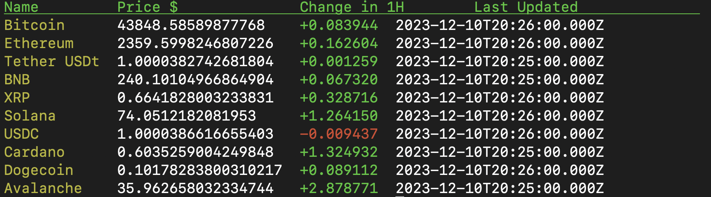

### GoCrypto with Terminal

Simple Terminal UI for GoCrypto. This project uses [CoinMarketCap](https://coinmarketcap.com/) API.

## Usage

```bash

go run main.go

```

## Screenshot of the project



## License


[MIT](./LICENSE)


## Author

Oguzhan Dogan


